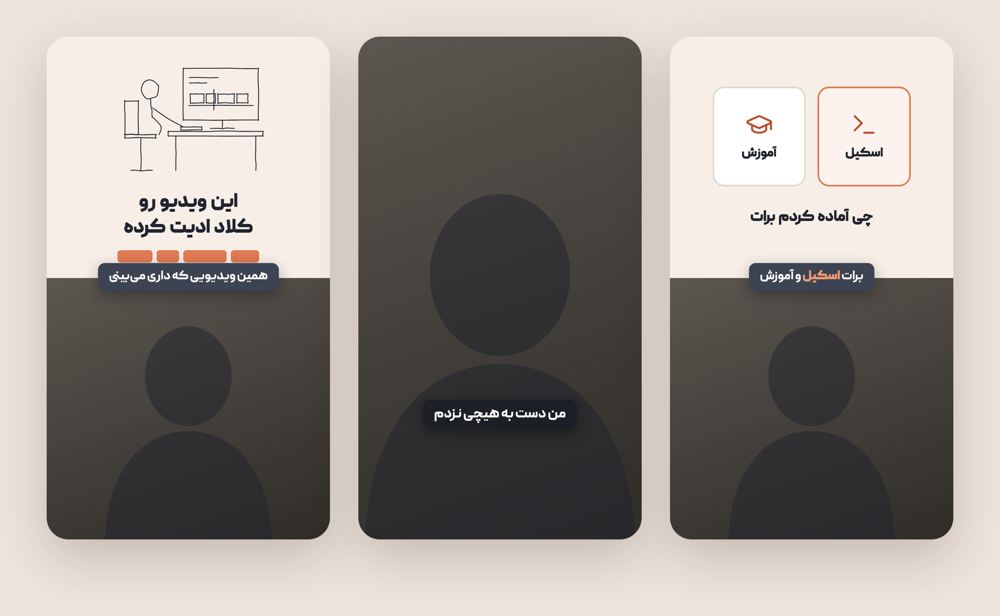
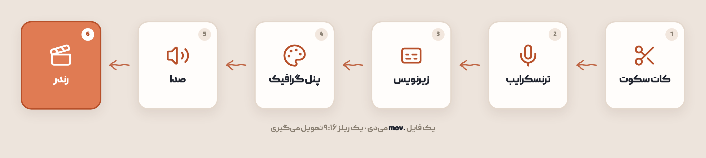
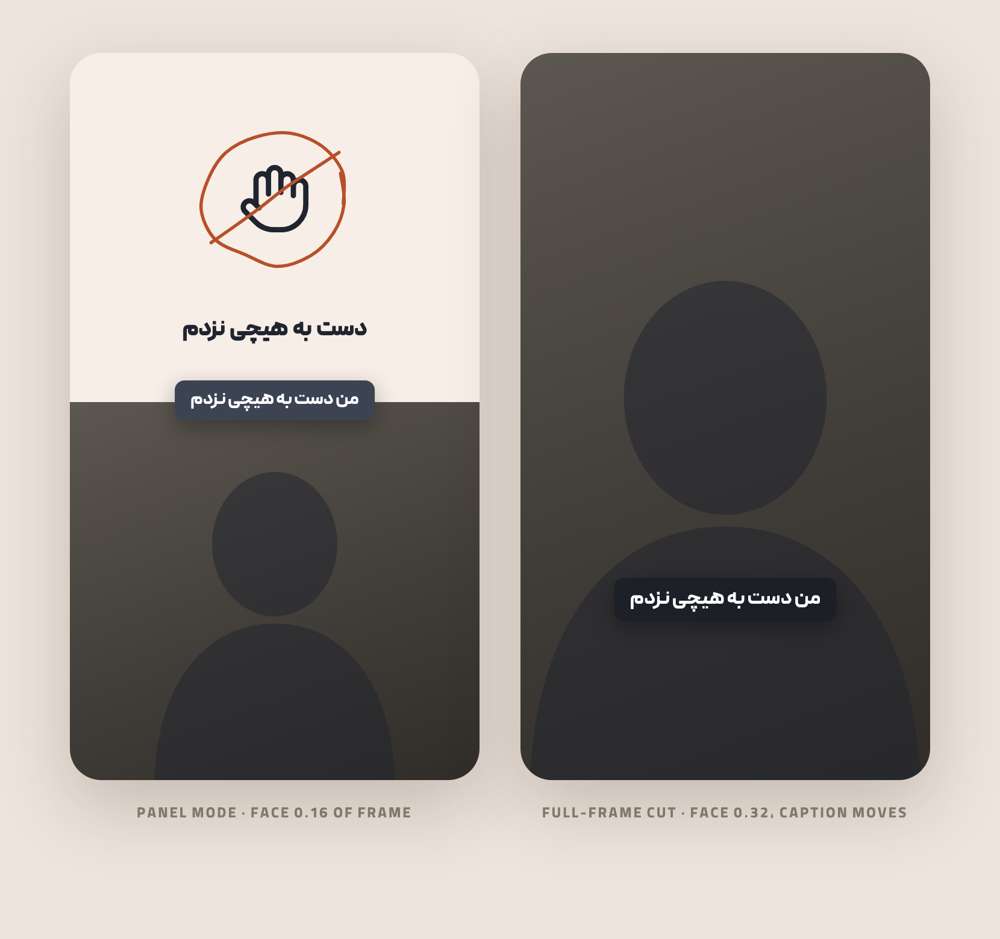

<div align="center">



# 🎬 persian-reel

### ویدیوی سلفی خام گوشیت رو به یک ریلز آمادهٔ اینستاگرام تبدیل می‌کنه

یک اسکیل برای **[کلاد](https://claude.ai)** — پنل موشن‌گرافیک، زیرنویس فارسی سینک با گفتار،<br>
اسکچ دست‌کشیده، ساند افکت و موزیک زمینه. همه لوکال، همه رایگان.

<br>


<br>

</div>

> [!TIP]
> <div dir="rtl">یک فایل `.mov` از گوشیت به کلاد بده و بگو **«این ویدیو رو برام ادیت کن»** — بقیه‌ش خودکاره.</div>

---

## 🔄 مسیر کار

<div align="center">

</div>

<div dir="rtl">

## ✨ چیکار می‌کنه

| | |
|---|---|
| ✂️ | **سکوت‌ها رو کات می‌کنه** — مکث‌ها کوتاه می‌شن و همهٔ نشانه‌های زمانی خودکار جابه‌جا می‌شن |
| 🎙️ | **فارسی رو ترنسکرایب می‌کنه** با Whisper large-v3 و زیرنویس رو روی مکث طبیعی می‌شکنه |
| 🎨 | **پنل گرافیکی می‌سازه** بالای کادر، که هر ۳ تا ۵ ثانیه عوض می‌شه |
| 🖊️ | **اسکچ می‌کشه** به‌صورت SVG واقعی که خط‌به‌خط جلوی چشم کشیده می‌شه |
| 🔊 | **صدا می‌ذاره** — افکت روی ضرب‌های انیمیشن، موزیک زیر صدای گوینده |
| 🎞️ | **رندر می‌گیره** فریم‌به‌فریم و قطعی با [HyperFrames](https://github.com/heygen-com/hyperframes) |

</div>

> [!NOTE]
> <div dir="rtl">همه‌چیز لوکال اجرا می‌شه. Whisper، ffmpeg، کیت اسکچ و بیش از **۵۴۰۰ آیکون** هیچ حسابی نمی‌خوان.<br>فقط کاتالوگ موزیک — که اختیاریه — به حساب کاربری نیاز داره.</div>

---

## 🚀 نصب

**در Claude Code:**

```bash
git clone https://github.com/aradazr/persian-reel ~/.claude/skills/persian-reel
```

**در Claude Desktop یا claude.ai:** فایل بسته‌بندی‌شده رو از [Releases](../../releases) بگیر
و در `Settings → Capabilities → Skills` آپلود کن.

بعدش فقط عادی با کلاد حرف بزن. اسکیل روی هر درخواست ویدیوی کوتاه فارسی خودش فعال می‌شه —
لازم نیست اسمش رو تایپ کنی.

<details>
<summary><b>📦 پیش‌نیازها</b></summary>

<br>

<div dir="rtl">

| | |
|---|---|
| 🟢 **Node 22+** و **Python 3.10+** | اجرا |
| 🎞️ **`ffmpeg`** و **`ffprobe`** | کار صدا و تصویر |
| 🌐 **Google Chrome** | HyperFrames از طریقش رندر می‌گیره |
| 🎯 **`npm i lucide-static simple-icons`** | ۲۰۰۰ آیکون + ۳۴۰۰ لوگوی برند، آفلاین |
| 🔤 **یک فونت فارسی** | پیدا، وزیرمتن، یا مال خودت — داخل ریپو نیست |

</div>

بررسی با:

```bash
npx hyperframes doctor
```

</details>

---

<div dir="rtl">

## 📐 چیدمان

بوم ۱۰۸۰×۱۹۲۰، تقسیم‌شده طوری که هیچ نیمه‌ای اون یکی رو خفه نکنه.

| ناحیه | هندسه | رنگ |
|---|---|---|
| 🟡 پنل گرافیک | `0,0 1080×920` | `#F7EEE7` |
| 🎥 گوینده | `0,920 1080×1000` | `object-fit: cover` |
| 💬 پیل زیرنویس | وسط‌چین در `top: 886` | `#3C4454` |

</div>

<div align="center">

`#F7EEE7` &nbsp;·&nbsp; `#20242F` &nbsp;·&nbsp; `#E07B53` &nbsp;·&nbsp; `#B7502A` &nbsp;·&nbsp; `#3C4454`


</div>

---

## 🎬 بازهٔ تمام‌قاب

<div align="center">

</div>

<div dir="rtl">

برداشتن پنل و پر کردن کادر با گوینده، همون چیزیه که نمی‌ذاره ریلز حس «قالب آماده» بده.
سه چیز باید **با هم** عوض بشن:

</div>

> [!WARNING]
> <div dir="rtl">**کات بزن، نه فید.** فید، پنل نیمه‌شفاف رو روی فوتیج متحرک می‌کشه و شبیه باگ می‌شه.</div>

> [!IMPORTANT]
> <div dir="rtl">**حدود ۲ برابر zoom کن.** صورت از `۰.۱۶` ارتفاع قاب به `۰.۳۲` می‌ره. بدون این، گوینده<br>فقط توی قاب خالی‌تری می‌شینه و اون لحظه حس «جای خالی» می‌ده نه تأکید.</div>

> [!NOTE]
> <div dir="rtl">**زیرنویس رو بیار پایین**، وگرنه می‌افته روی صورتش.</div>

---

<div dir="rtl">

## 🧰 چی داخلشه

| اسکریپت | کارش |
|---|---|
| ✂️ `cutsilence.py` | مکث‌ها رو کوتاه می‌کنه و نگاشت زمانی می‌ده تا نشانه‌های موجود جابه‌جا شن |
| 🎙️ `transcribe.py` | Whisper large-v3 ← تایم‌کد کلمه‌ای ← خطوط اندازهٔ زیرنویس |
| 🖊️ `sketch.py` | SVG دست‌کشیدهٔ قطعی — لرزش seed-دار، هیچ‌وقت `Math.random()` |
| 🎯 `icon.py` | آیکون Lucide رو با ضخامت مناسب ویدیو inline می‌کنه |
| 🏷️ `brand.py` | لوگوی رسمی برندها رو می‌گیره (simple-icons ← svgl) |
| 🔊 `audiolevel.py` | `data-volume` رو از سطح اندازه‌گیری‌شده حساب می‌کنه، بعد رندر رو تأیید می‌کنه |

مستندات عمیق‌تر: [کامپوزیشن](references/composition.md) · [گرافیک](references/graphics.md) · [صدا](references/audio.md)

</div>

---

## 🪤 چهار تلهٔ فارسی

<div dir="rtl">

این‌ها وقت واقعی از آدم می‌گیرن و **هیچ‌کدوم خودشون رو اعلام نمی‌کنن**.

</div>

> [!CAUTION]
> <div dir="rtl"><b>`<html dir="rtl">` ویدیو رو کاملاً سیاه رندر می‌کنه</b><br>پریویو بی‌نقص به نظر می‌رسه. به‌جاش `direction: rtl` رو در CSS فقط روی المان‌های متنی بذار.</div>

> [!WARNING]
> <div dir="rtl"><b>`letter-spacing` منفی فاصلهٔ بین کلمات فارسی رو می‌بنده</b><br>تیتر لاتین تراکینگ تنگ رو تحمل می‌کنه، فارسی نه — چون در خط متصل، فاصله **تنها مرز کلمه‌ست**.</div>

```css
/* ❌ */  letter-spacing: -1px;
/* ✅ */  letter-spacing: 0;  word-spacing: 0.1em;
```

> [!WARNING]
> <div dir="rtl"><b>صفر فارسی «۰» یک نقطه‌ست</b><br>عدد ۳۰۰ پیکسلی به‌صورت یک ذره رندر می‌شه. عدد رو با حروف بنویس.</div>

> [!WARNING]
> <div dir="rtl"><b>مدل `small` ویسپر فارسی رو خراب می‌کنه</b><br>«می‌شنویم» رو **«میشنبیم»** شنید. از `large-v3` استفاده کن و باز هم بازخوانی کن.</div>

---

## 🔊 یک چیز دیگه

> [!IMPORTANT]
> <div dir="rtl">**سطح صدا رو اندازه بگیر، حدس نزن.** یک بار ده تا نشانهٔ صوتی با ولوم دستی گذاشته شد و<br>**۹ تاشون کاملاً ناشنیدنی بودند** — چون میانگین یک فایل `−۵dB` بود و اون یکی `−۳۰٫۷dB`.<br>یک عدد ولوم واحد نمی‌تونه به هر دو خدمت کنه.</div>

```bash
python3 scripts/audiolevel.py plan   talk.mp4 assets/sfx/*.mp3   # → data-volume هرکدوم
python3 scripts/audiolevel.py verify render.mp4 talk.mp4 --cues 3.5 4.2 12.0
```

---

<div dir="rtl">

## 📜 لایسنس

کد **MIT** ـه. دو چیز عمداً داخل ریپو **نیست**:

- 🔤 **فونت** — پیدا تجاریه؛ لایسنس خودت رو بیار، یا از [وزیرمتن](https://github.com/rastikerdar/vazirmatn) استفاده کن (SIL OFL)
- 🏷️ **لوگوی برندها** — `brand.py` در لحظه می‌گیرتشون به‌جای توزیع علامت تجاری. وقتی تطابق دقیق پیدا نکنه **حدس نمی‌زنه**؛ لوگوی اشتباهی که درست رندر می‌شه، بدتر از لوگوی نبوده‌ست

</div>

---

<details>
<summary><b>🇬🇧 English</b></summary>

<br>

**Turn a phone talking-head clip into a finished Persian Instagram Reel — automatically.**

A [Claude](https://claude.ai) skill that packages raw selfie footage with a motion-graphics
panel, RTL captions synced to speech, hand-drawn ink sketches, sound effects and a music bed,
then renders it deterministically to MP4 through
[HyperFrames](https://github.com/heygen-com/hyperframes).

```bash
git clone https://github.com/aradazr/persian-reel ~/.claude/skills/persian-reel
```

Then talk to Claude normally — the skill triggers on any Persian short-form video request.

Everything runs locally: Whisper large-v3 for transcription, ffmpeg for cutting, a
deterministic sketch kit for illustration, 5,400+ offline icons. Only the optional music
catalogue needs an account.

**Four Persian traps this skill saves you from**, none of which announce themselves:
`<html dir="rtl">` renders a completely black video while preview looks fine; negative
`letter-spacing` closes the gaps between Persian words; the Persian zero «۰» is a dot, so a
300px numeral renders as a speck; and Whisper's `small` model mangles Persian badly enough
to be unusable.

Requirements, layout geometry, the full-frame beat technique, and the audio-levelling
procedure are documented in depth under [`references/`](references/) in English.

Code is MIT. Fonts and brand logos are deliberately not bundled — Peyda is commercial, and
`brand.py` fetches trademarks on demand rather than redistributing them.

</details>

---

<div align="center">

ساخته‌شده روی
<a href="https://github.com/heygen-com/hyperframes">HyperFrames</a> ·
<a href="https://github.com/lucide-icons/lucide">Lucide</a> ·
<a href="https://github.com/simple-icons/simple-icons">simple-icons</a> ·
<a href="https://github.com/ggerganov/whisper.cpp">whisper.cpp</a>

<sub>اگر به کارت اومد، یک ⭐ بده</sub>

</div>
